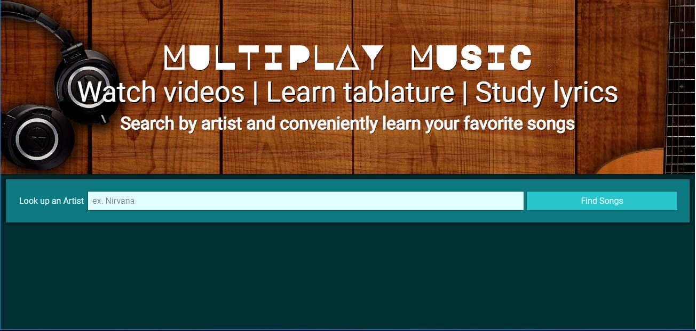
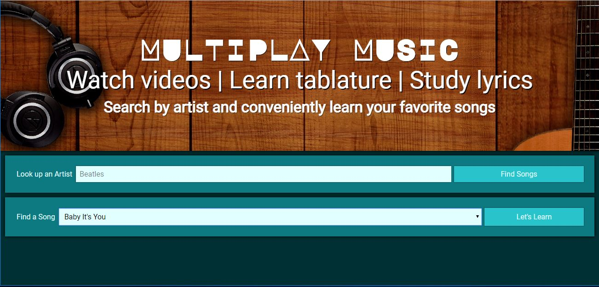
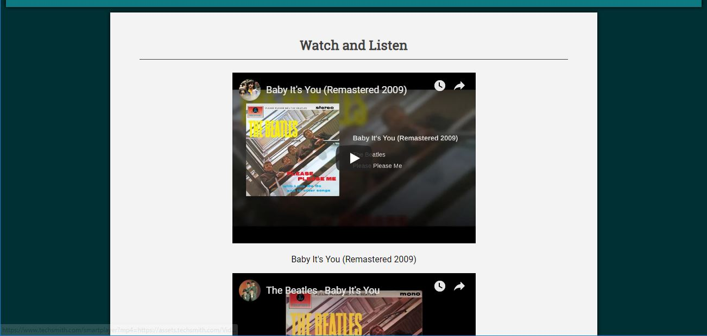
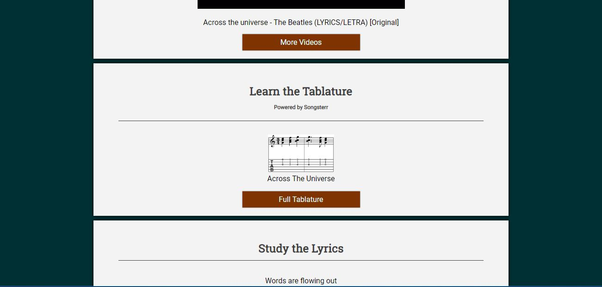
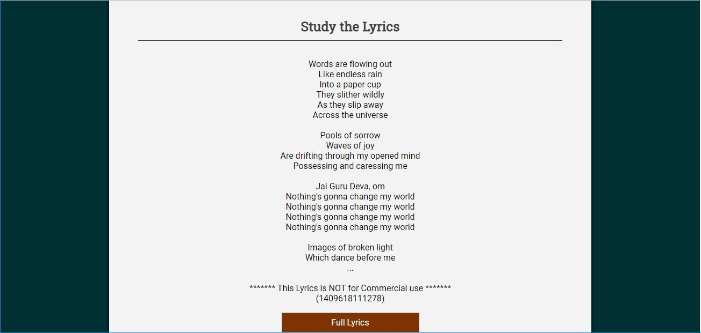

# Multiplay Music
[https://namninja.github.io/multiplay-music](https://namninja.github.io/multiplay-music)

### Summary

A multi-API hack that lets you learn a song by providing videos, tablature, and lyrics.  The main 
API that the site draws from is Songsterr. The motivation for this site was to create a one stop shop 
for learning music. I play guitar and have used Songsterr before. It's a great technology for learning 
songs through tablature, however Songsterr does not provide lyrics. My main workflow for learning a song: 
listening to it, learning the chords, and then learning the lyrics. I often go back and forth until 
I can play along and sing with the song.  Basically, this idea is for my own personal convenience.

### Screen shots

#### Search for an Artist

#### If the artist exists in the Songsterr API, then a drop down of available songs will populate.

#### Once a song is chosen, videos of the song will be displayed

#### A link to the Tablature at Songsterr will also display

#### Finally, a snippet f the Lyrics will be displayed along with a link to the full lyrics

### Technology 

#### Languages:
HTML/CSS/Javascript/JQuery

#### APIs
[Songsterr](https://www.songsterr.com/a/wa/api)
[Youtube](https://developers.google.com/youtube)
[MusicxMatch](https://developer.musixmatch.com/)

